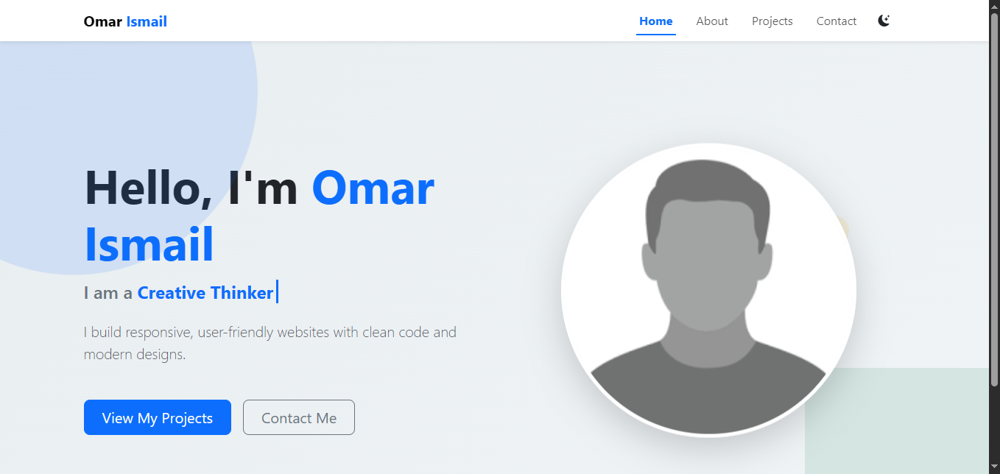

# Personal Portfolio Website



A professional, multi-page personal portfolio built to showcase modern front-end development skills. This project is fully responsive and features interactive elements built with Vanilla JavaScript and Bootstrap.

## Live Demo

[Check out my live website here!](https://mr4556825-source.github.io/my-portfolio/)

## Technology Stack

- **HTML5:** Semantic structure for better SEO.
- **CSS3:** Custom styling and layout.
- **Bootstrap 5.3:** For a mobile-first responsive grid system and components.
- **JavaScript (ES6+):** For interactive features and theme switching.
- **Bootstrap Icons:** Scalable vector icons.

## Key Features

1.  **Multi-Page Navigation:** Separate pages for Home, About, Projects, and Contact.
2.  **Dark/Light Mode:** A toggle that saves user preference.
3.  **Form Validation:** Client-side validation to ensure clean user data.
4.  **Responsive Design:** Seamless experience across Mobile, Tablet, and Desktop.
5.  **Interactive Interests:** Custom-styled badges with hover effects.
6.  **Back-to-Top Button:** For improved user navigation.

## Project Structure
```text
├── index.html # Homepage
├── about.html # Bio, Skills & Interests
├── projects.html # Gallery of work
├── contact.html # Contact form
├── css/
│ └── style.css # Custom styles
├── js/
│ └── script.js # Interactivity logic
└── images/ # All visual assets (Favicon, etc.)
```

## Setup Instructions

To run this project locally on your machine, follow these simple steps:

1. **Clone the Repository:**
   Open your terminal and run the following command:
   ```bash
   git clone https://github.com/mr4556825/my-portfolio.git
   ```

2. **Navigate to the project folder:**
    ```bash
    cd my-portfolio
    ```

3. **Open the Project:**
    Locate and open index.html in your favorite web browser.


## Reflection

During this project, I focused on writing clean, modular, and maintainable code without the use of AI generation tools. I successfully tackled technical challenges such as:

Path Management: Resolving relative path issues for GitHub Pages deployment.

State Management: Ensuring a consistent Dark Mode experience across multiple HTML pages.

Responsive Layouts: Mastering Bootstrap’s grid to handle complex UI elements on smaller screens.

This project significantly improved my understanding of the front-end development workflow from planning to deployment.